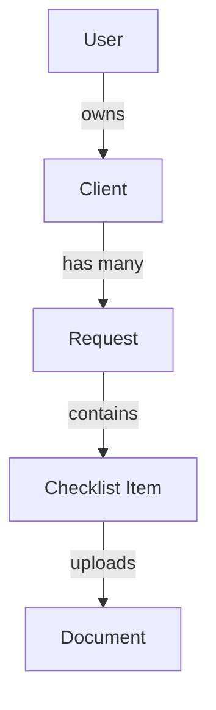
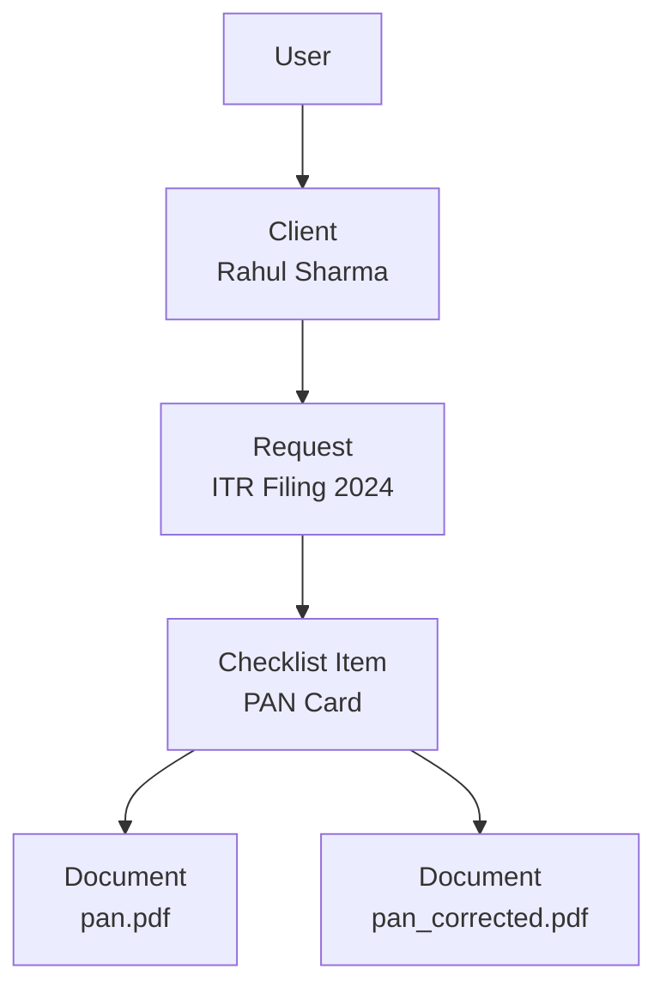

# SnapDocs – Data Model (Source of Truth)

## Core Hierarchy

---

---

## Why This Model Exists

This model mirrors **real-world professional workflows**, not technical shortcuts.

---

## Intent vs Proof

- Checklist Item = Intent
- Document = Proof

This enables:

- Progress tracking
- Reminders
- Audits
- Clean UI

---

## What This Model Solves

- Multiple requests per client
- Partial document submission
- Re-uploads
- History preservation

---

## What This Model Avoids

- Document confusion
- Schema rewrites
- Ambiguous status
- Over engineering

---

## Long-Term Readiness

- Multi-user orgs
- Teams
- Advanced analytics
- Compliance requirements

Without breaking changes.
